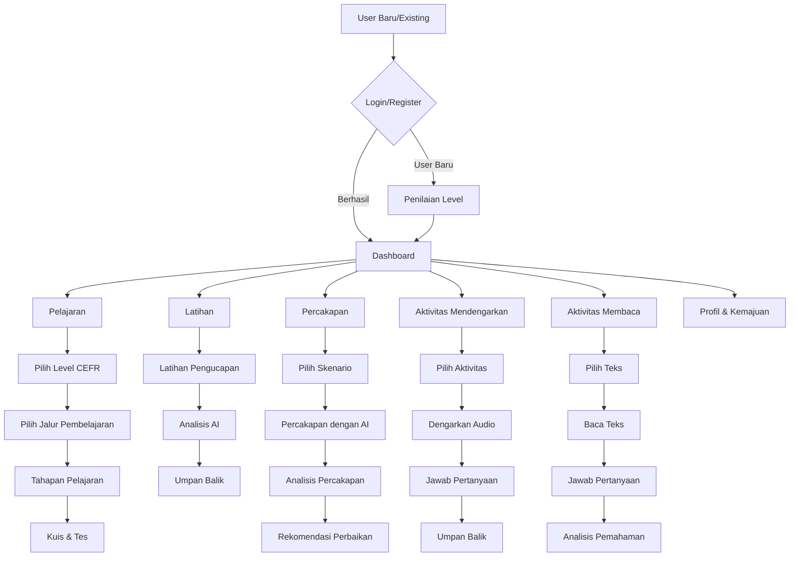
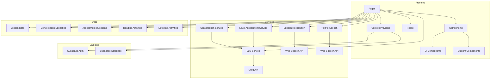
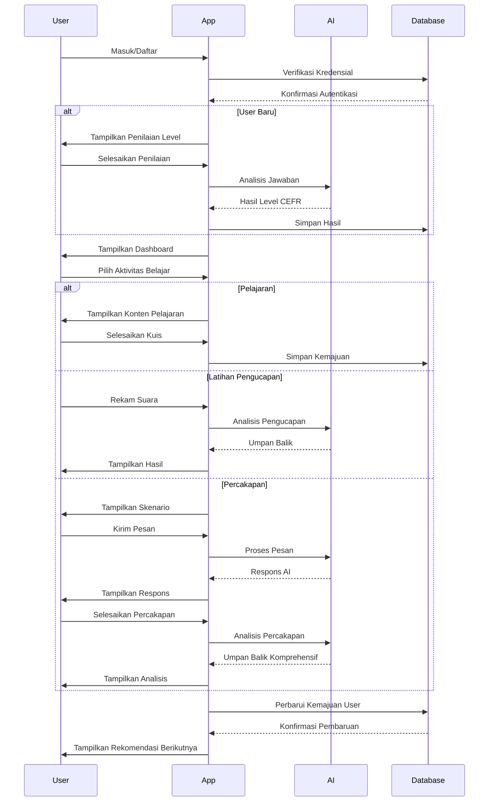

# LinggoID - English Learning Hub for Indonesian Speakers


## Latar Belakang (Background)

LinggoID adalah platform pembelajaran bahasa Inggris yang dirancang khusus untuk penutur bahasa Indonesia. Aplikasi ini menggabungkan teknologi AI terkini dengan metode pembelajaran bahasa yang terbukti efektif untuk membantu pengguna menguasai bahasa Inggris dengan percaya diri. Platform ini menawarkan pengalaman belajar yang personal, interaktif, dan komprehensif untuk meningkatkan kemampuan berbahasa Inggris dalam berbagai konteks, baik akademis maupun profesional.

LinggoID is an English language learning platform specifically designed for Indonesian speakers. This application combines cutting-edge AI technology with proven language learning methods to help users master English with confidence. The platform offers a personalized, interactive, and comprehensive learning experience to improve English language skills in various contexts, both academic and professional.

## Teknologi yang Digunakan (Technologies Used)

LinggoID dibangun dengan teknologi modern untuk memberikan pengalaman belajar yang optimal:

- **Frontend Framework**: React dengan TypeScript
- **Build Tool**: Vite untuk pengembangan yang cepat dan efisien
- **Styling**: Tailwind CSS dan shadcn-ui untuk antarmuka yang modern dan responsif
- **State Management**: React Context API dan React Query
- **Routing**: React Router untuk navigasi halaman
- **AI Integration**: 
  - Groq LLM API (menggunakan model Llama-3.1-8b-instant) untuk analisis bahasa dan umpan balik
  - Web Speech API untuk pengenalan suara dan text-to-speech
- **Authentication**: Supabase untuk manajemen pengguna dan autentikasi
- **Database**: Supabase PostgreSQL untuk penyimpanan data

## Fitur Utama (Main Features)

### 1. Penilaian Level Bahasa (Language Level Assessment)
- Tes komprehensif untuk menentukan level CEFR (A1-C2) pengguna
- Analisis kekuatan dan kelemahan bahasa
- Rekomendasi pelajaran berdasarkan hasil tes

### 2. Pembelajaran Terstruktur (Structured Learning)
- Pelajaran yang diorganisir berdasarkan level CEFR (A1-C2)
- Jalur pembelajaran untuk konteks bisnis dan akademis
- Konten yang disesuaikan dengan kebutuhan penutur bahasa Indonesia

### 3. Latihan Interaktif (Interactive Practice)
- Latihan pengucapan dengan umpan balik AI
- Percakapan simulasi dengan AI untuk melatih kemampuan berbicara
- Kuis dan tes untuk mengevaluasi pemahaman

### 4. Aktivitas Mendengarkan dan Membaca (Listening and Reading Activities)
- Latihan mendengarkan dengan berbagai aksen dan kecepatan
- Aktivitas membaca dengan teks dari berbagai tingkat kesulitan
- Analisis pemahaman dan umpan balik

### 5. Percakapan dengan AI (AI Conversations)
- Role-play dengan AI dalam berbagai skenario kehidupan nyata
- Umpan balik langsung tentang tata bahasa, kosakata, dan kelancaran
- Analisis percakapan komprehensif

### 6. Dashboard Kemajuan (Progress Dashboard)
- Pelacakan kemajuan belajar
- Statistik penggunaan dan pencapaian
- Rekomendasi pelajaran yang dipersonalisasi

## Alur Aplikasi (Application Flow)



## Arsitektur Aplikasi (Application Architecture)



## Alur Proses Pembelajaran (Learning Process Flow)



## Cara Penggunaan (How to Use)

### Instalasi dan Pengaturan (Installation and Setup)

1. Clone repositori:
   ```sh
   git clone <URL_REPOSITORI>
   cd linggo-english-hub
   ```

2. Instal dependensi:
   ```sh
   npm install
   ```

3. Salin file `.env.example` ke `.env` dan tambahkan Groq API key Anda:
   ```
   VITE_GROQ_API_KEY=your_groq_api_key_here
   ```

4. Jalankan server pengembangan:
   ```sh
   npm run dev
   ```

### Memulai Pembelajaran (Starting Learning)

1. **Daftar/Masuk**: Buat akun baru atau masuk dengan akun yang sudah ada
2. **Penilaian Level**: Pengguna baru akan diminta untuk menyelesaikan penilaian level
3. **Dashboard**: Lihat kemajuan dan rekomendasi pelajaran
4. **Pelajaran**: Pilih pelajaran berdasarkan level CEFR dan jalur pembelajaran
5. **Latihan**: Latih pengucapan dan dapatkan umpan balik langsung
6. **Percakapan**: Praktikkan percakapan dengan AI dalam berbagai skenario
7. **Aktivitas**: Tingkatkan kemampuan mendengarkan dan membaca

## Kontribusi (Contribution)

Kami terbuka untuk kolaborasi dan kontribusi untuk meningkatkan platform LinggoID. Jika Anda tertarik untuk berkontribusi, silakan:

1. Fork repositori
2. Buat branch fitur (`git checkout -b feature/AmazingFeature`)
3. Commit perubahan Anda (`git commit -m 'Add some AmazingFeature'`)
4. Push ke branch (`git push origin feature/AmazingFeature`)
5. Buka Pull Request

## Lisensi (License)

Proyek ini dilisensikan di bawah [MIT License](LICENSE).

## Kontak (Contact)

Tim LinggoID - [info@linggoid.com](mailto:info@linggoid.com)

Website: [https://linggoid.com](https://linggoid.com)
